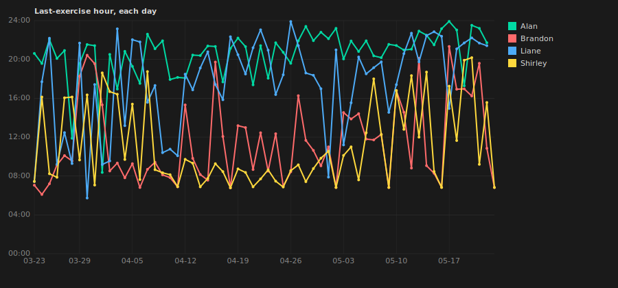

# 60-Day Recap Report
Generated 2026-05-23 · Participants: Alan, Brandon, Liane, Shirley · Days analyzed: 61

## Completion times across the challenge
Each line shows one person's *last exercise of the day*, every day. Flat horizontal line = locked-in routine. Drifting downward = trending earlier.



## 1. Completion-hour consistency
Lower stddev = more automatic / habit-like.

### Alan
> Average wrap-up **20:34** · stddev **2.58h** (loose — finishes at varying times) · trend: **consolidating ✅**

| Week | Days | Avg last-exercise | Stddev (hrs) |
|---|---|---|---|
| 2026-W12 | 6 | 19:11 | 3.35 |
| 2026-W13 | 7 | 18:27 | 4.37 |
| 2026-W14 | 7 | 19:47 | 1.91 |
| 2026-W15 | 7 | 20:04 | 1.43 |
| 2026-W16 | 7 | 20:24 | 1.75 |
| 2026-W17 | 7 | 22:08 | 1.18 |
| 2026-W18 | 7 | 20:58 | 0.75 |
| 2026-W19 | 7 | 21:56 | 0.84 |
| 2026-W20 | 6 | 22:07 | 2.26 |
| **Overall** | **61** | **20:34** | **2.58** |

### Brandon
> Average wrap-up **11:29** · stddev **4.22h** (highly variable) · trend: **loosening ⚠️**

| Week | Days | Avg last-exercise | Stddev (hrs) |
|---|---|---|---|
| 2026-W12 | 6 | 08:11 | 1.47 |
| 2026-W13 | 7 | 14:11 | 5.10 |
| 2026-W14 | 7 | 08:09 | 0.97 |
| 2026-W15 | 7 | 11:21 | 4.38 |
| 2026-W16 | 7 | 10:44 | 2.40 |
| 2026-W17 | 7 | 10:33 | 2.80 |
| 2026-W18 | 7 | 12:12 | 2.46 |
| 2026-W19 | 7 | 12:04 | 4.70 |
| 2026-W20 | 7 | 15:32 | 4.67 |
| **Overall** | **62** | **11:29** | **4.22** |

### Liane
> Average wrap-up **17:37** · stddev **4.74h** (highly variable) · trend: **consolidating ✅**

| Week | Days | Avg last-exercise | Stddev (hrs) |
|---|---|---|---|
| 2026-W12 | 6 | 13:03 | 5.26 |
| 2026-W13 | 7 | 14:16 | 6.16 |
| 2026-W14 | 7 | 15:26 | 4.83 |
| 2026-W15 | 7 | 18:42 | 2.10 |
| 2026-W16 | 7 | 19:51 | 2.06 |
| 2026-W17 | 7 | 18:18 | 4.76 |
| 2026-W18 | 7 | 16:60 | 3.09 |
| 2026-W19 | 7 | 21:10 | 1.88 |
| 2026-W20 | 6 | 20:31 | 2.51 |
| **Overall** | **61** | **17:37** | **4.74** |

### Shirley
> Average wrap-up **11:05** · stddev **4.19h** (highly variable) · trend: **loosening ⚠️**

| Week | Days | Avg last-exercise | Stddev (hrs) |
|---|---|---|---|
| 2026-W12 | 6 | 11:58 | 4.14 |
| 2026-W13 | 7 | 13:30 | 4.20 |
| 2026-W14 | 7 | 10:33 | 4.26 |
| 2026-W15 | 7 | 08:19 | 1.11 |
| 2026-W16 | 7 | 07:48 | 0.73 |
| 2026-W17 | 7 | 08:44 | 1.20 |
| 2026-W18 | 7 | 11:11 | 3.43 |
| 2026-W19 | 7 | 13:25 | 4.37 |
| 2026-W20 | 7 | 14:22 | 4.86 |
| **Overall** | **62** | **11:05** | **4.19** |

## 2. Session compactness — gap between first and last exercise
Small gap = one-block workout (≤30 min). Large gap = spread across the day.

### Alan
> Avg gap **2.75h** (short workout window) · **62%** single-block · **16%** all-day · trend: **tightening into a session ✅**

| Week | Days | Avg gap (hrs) | Median gap | % single-block (≤30m) | % all-day (≥6h) |
|---|---|---|---|---|---|
| 2026-W12 | 6 | 4.41 | 2.60 | 17% | 17% |
| 2026-W13 | 7 | 4.08 | 0.58 | 43% | 29% |
| 2026-W14 | 7 | 6.49 | 5.87 | 29% | 43% |
| 2026-W15 | 7 | 1.97 | 0.00 | 86% | 14% |
| 2026-W16 | 7 | 2.56 | 0.83 | 43% | 14% |
| 2026-W17 | 7 | 0.45 | 0.00 | 86% | 0% |
| 2026-W18 | 7 | 1.98 | 0.00 | 86% | 14% |
| 2026-W19 | 7 | 2.40 | 0.08 | 86% | 14% |
| 2026-W20 | 6 | 0.32 | 0.00 | 83% | 0% |
| **Overall** | **61** | **2.75** | **0.13** | **62%** | **16%** |

### Brandon
> Avg gap **1.18h** (short workout window) · **63%** single-block · **5%** all-day · trend: **spreading out ⚠️**

| Week | Days | Avg gap (hrs) | Median gap | % single-block (≤30m) | % all-day (≥6h) |
|---|---|---|---|---|---|
| 2026-W12 | 6 | 0.00 | 0.00 | 100% | 0% |
| 2026-W13 | 7 | 0.71 | 0.28 | 57% | 0% |
| 2026-W14 | 7 | 0.47 | 0.40 | 57% | 0% |
| 2026-W15 | 7 | 0.85 | 0.33 | 71% | 0% |
| 2026-W16 | 7 | 0.20 | 0.00 | 86% | 0% |
| 2026-W17 | 7 | 0.89 | 0.00 | 57% | 0% |
| 2026-W18 | 7 | 0.69 | 0.40 | 57% | 0% |
| 2026-W19 | 7 | 2.05 | 0.50 | 71% | 14% |
| 2026-W20 | 7 | 4.63 | 4.23 | 14% | 29% |
| **Overall** | **62** | **1.18** | **0.33** | **63%** | **5%** |

### Liane
> Avg gap **0.86h** (knocks it out in one block) · **87%** single-block · **7%** all-day · trend: **tightening into a session ✅**

| Week | Days | Avg gap (hrs) | Median gap | % single-block (≤30m) | % all-day (≥6h) |
|---|---|---|---|---|---|
| 2026-W12 | 6 | 2.79 | 0.00 | 67% | 33% |
| 2026-W13 | 7 | 0.79 | 0.12 | 86% | 0% |
| 2026-W14 | 7 | 0.49 | 0.08 | 86% | 0% |
| 2026-W15 | 7 | 0.02 | 0.00 | 100% | 0% |
| 2026-W16 | 7 | 0.03 | 0.00 | 100% | 0% |
| 2026-W17 | 7 | 0.01 | 0.00 | 100% | 0% |
| 2026-W18 | 7 | 1.57 | 0.00 | 86% | 14% |
| 2026-W19 | 7 | 2.08 | 0.30 | 57% | 14% |
| 2026-W20 | 6 | 0.12 | 0.00 | 100% | 0% |
| **Overall** | **61** | **0.86** | **0.00** | **87%** | **7%** |

### Shirley
> Avg gap **0.77h** (knocks it out in one block) · **90%** single-block · **6%** all-day · trend: **spreading out ⚠️**

| Week | Days | Avg gap (hrs) | Median gap | % single-block (≤30m) | % all-day (≥6h) |
|---|---|---|---|---|---|
| 2026-W12 | 6 | 0.03 | 0.00 | 100% | 0% |
| 2026-W13 | 7 | 0.03 | 0.00 | 100% | 0% |
| 2026-W14 | 7 | 0.07 | 0.03 | 100% | 0% |
| 2026-W15 | 7 | 0.06 | 0.00 | 100% | 0% |
| 2026-W16 | 7 | 0.21 | 0.20 | 100% | 0% |
| 2026-W17 | 7 | 0.20 | 0.22 | 100% | 0% |
| 2026-W18 | 7 | 0.25 | 0.22 | 86% | 0% |
| 2026-W19 | 7 | 1.63 | 0.00 | 86% | 14% |
| 2026-W20 | 7 | 4.37 | 0.68 | 43% | 43% |
| **Overall** | **62** | **0.77** | **0.12** | **90%** | **6%** |

## 3. Exercise-order stability
Fixed order = workout has become a script — less decision-making, more autopilot.

### Alan
> Top order **squats→pushups→plank** (**56%** of days) · preferred order most days · first half 37% → second half 74% (**consolidating ✅**)

| Order | Days | % |
|---|---|---|
| squats→pushups→plank | 34 | 56% |
| pushups→squats→plank | 24 | 39% |
| pushups→plank→squats | 2 | 3% |
| squats→plank→pushups | 1 | 2% |

### Brandon
> Top order **squats→pushups→plank** (**92%** of days) · rock-solid routine · first half 94% → second half 90% (**stable**)

| Order | Days | % |
|---|---|---|
| squats→pushups→plank | 57 | 92% |
| pushups→plank→squats | 3 | 5% |
| squats→plank→pushups | 1 | 2% |
| plank→squats→pushups | 1 | 2% |

### Liane
> Top order **squats→pushups→plank** (**93%** of days) · rock-solid routine · first half 93% → second half 94% (**stable**)

| Order | Days | % |
|---|---|---|
| squats→pushups→plank | 57 | 93% |
| pushups→squats→plank | 1 | 2% |
| plank→squats→pushups | 1 | 2% |
| squats→plank→pushups | 1 | 2% |
| pushups→plank→squats | 1 | 2% |

### Shirley
> Top order **squats→pushups→plank** (**53%** of days) · preferred order most days · first half 77% → second half 29% (**diversifying**)

| Order | Days | % |
|---|---|---|
| squats→pushups→plank | 33 | 53% |
| pushups→squats→plank | 28 | 45% |
| pushups→plank→squats | 1 | 2% |

## 4. Weekend drift
Weekend hour minus weekday hour. Shrinking toward 0 = identity habit, not work-schedule habit.

### Alan
> Weekday **20:39** · weekend **20:18** · no real drift — same regardless of day ✅

| Week | Weekday avg | Weekend avg | Drift (hrs) |
|---|---|---|---|
| 2026-W12 | 20:39 | 11:53 | -8.77 |
| 2026-W13 | 17:45 | 20:12 | +2.45 |
| 2026-W14 | 20:13 | 18:43 | -1.50 |
| 2026-W15 | 20:15 | 19:37 | -0.64 |
| 2026-W16 | 19:59 | 21:28 | +1.49 |
| 2026-W17 | 22:26 | 21:24 | -1.04 |
| 2026-W18 | 21:02 | 20:48 | -0.24 |
| 2026-W19 | 21:47 | 22:18 | +0.51 |
| 2026-W20 | 21:45 | 23:55 | +2.17 |
| **Overall** | **20:39** | **20:18** | **-0.35** |

### Brandon
> Weekday **11:47** · weekend **10:44** · actually **1.1h earlier** on weekends

| Week | Weekday avg | Weekend avg | Drift (hrs) |
|---|---|---|---|
| 2026-W12 | 07:55 | 09:33 | +1.63 |
| 2026-W13 | 14:38 | 13:02 | -1.59 |
| 2026-W14 | 08:10 | 08:04 | -0.10 |
| 2026-W15 | 11:28 | 11:03 | -0.42 |
| 2026-W16 | 10:59 | 10:04 | -0.92 |
| 2026-W17 | 11:43 | 07:38 | -4.10 |
| 2026-W18 | 12:49 | 10:41 | -2.14 |
| 2026-W19 | 12:10 | 11:49 | -0.36 |
| 2026-W20 | 16:07 | 14:04 | -2.04 |
| **Overall** | **11:47** | **10:44** | **-1.05** |

### Liane
> Weekday **17:37** · weekend **17:35** · no real drift — same regardless of day ✅

| Week | Weekday avg | Weekend avg | Drift (hrs) |
|---|---|---|---|
| 2026-W12 | 13:48 | 09:17 | -4.51 |
| 2026-W13 | 13:00 | 17:26 | +4.43 |
| 2026-W14 | 15:10 | 16:04 | +0.88 |
| 2026-W15 | 18:00 | 20:24 | +2.40 |
| 2026-W16 | 20:01 | 19:27 | -0.57 |
| 2026-W17 | 16:39 | 22:26 | +5.79 |
| 2026-W18 | 18:38 | 12:53 | -5.76 |
| 2026-W19 | 21:40 | 19:53 | -1.78 |
| 2026-W20 | 21:37 | 14:57 | -6.67 |
| **Overall** | **17:37** | **17:35** | **-0.04** |

### Shirley
> Weekday **11:29** · weekend **09:60** · actually **1.5h earlier** on weekends

| Week | Weekday avg | Weekend avg | Drift (hrs) |
|---|---|---|---|
| 2026-W12 | 11:09 | 16:08 | +4.99 |
| 2026-W13 | 15:02 | 09:41 | -5.35 |
| 2026-W14 | 10:18 | 11:09 | +0.85 |
| 2026-W15 | 08:20 | 08:15 | -0.08 |
| 2026-W16 | 07:49 | 07:48 | -0.01 |
| 2026-W17 | 09:09 | 07:41 | -1.46 |
| 2026-W18 | 12:16 | 08:28 | -3.80 |
| 2026-W19 | 14:04 | 11:49 | -2.25 |
| 2026-W20 | 15:18 | 12:02 | -3.27 |
| **Overall** | **11:29** | **09:60** | **-1.49** |

## 5. Group cohesion — when's the last person done?
Tracks the latest finisher each day. Trending earlier or tighter spread = group pulling itself together.

| Week | Days | Avg "last done" | Avg spread | 🐤 Pacesetter | ⚓ Anchor |
|---|---|---|---|---|---|
| 2026-W12 | 6 | 19:55 | 11.99 hrs | Brandon (4) | Alan (4) |
| 2026-W13 | 7 | 21:06 | 13.04 hrs | Brandon (3) | Alan (4) |
| 2026-W14 | 7 | 20:47 | 12.75 hrs | Brandon (6) | Alan (5) |
| 2026-W15 | 7 | 20:18 | 12.01 hrs | Shirley (5) | Alan (5) |
| 2026-W16 | 7 | 21:36 | 13.81 hrs | Shirley (6) | Alan (4) |
| 2026-W17 | 7 | 22:45 | 14.54 hrs | Brandon/Shirley (3) | Alan (6) |
| 2026-W18 | 7 | 20:58 | 10.78 hrs | Shirley (4) | Alan (7) |
| 2026-W19 | 7 | 22:22 | 11.71 hrs | Brandon (4) | Alan (5) |
| 2026-W20 | 6 | 22:51 | 9.54 hrs | Brandon (3) | Alan (5) |
| **Overall** | **61** | **21:24** | **12.29 hrs** | **Brandon (29)** | **Alan (45)** |

**Trend:** last-person time 19:55 → 22:51 (+2.92 hrs)
**Spread:** 11.99 → 9.54 hrs (✅ tightening)

### Finisher tally — who's the pacesetter, who's the anchor?
Days each person was the *first* finisher (early bird 🐤) vs the *last* finisher (anchor ⚓) of the day.

| Person | 🐤 First | ⚓ Last |
|---|---|---|
| Brandon | 29 (48%) | 0 (0%) |
| Shirley | 27 (44%) | 2 (3%) |
| Liane | 4 (7%) | 14 (23%) |
| Alan | 1 (2%) | 45 (74%) |

**Pacesetter:** Brandon (first 29/61 days)  ·  **Anchor:** Alan (last 45/61 days)

## 6. Time-of-day heatmap (day-of-week × hour)
Where do completions cluster across the week? Each cell = number of exercise check-offs in that hour. Darker = more activity.
Scale per person (normalized to that person's max). Legend: ` ` none · `░` low · `▒` mid · `▓` high · `█` peak.

### Alan
```
     000000000011111111112222
     012345678901234567890123
Mon                   ░░ █▓ ░
Tue         ░    ░    ▒░░▒▒░░
Wed       ░  ▒ ░      ░ ░ ▓▒░
Thu        ░ ░         ░░▓▓▒░
Fri          ░       ▒▒░░▒▓░ 
Sat         ░   ░░     ░ ▓▒ ▒
Sun         ░ ░       ░░▒░░░░
```

### Brandon
```
     000000000011111111112222
     012345678901234567890123
Mon        ░░░░ ░░░░░░   ░   
Tue        ░░▓ ░░░ ░ ░░ ░    
Wed         ▒░░░░░░░░░   ░   
Thu         ░▓▒ ░       ░    
Fri         ░░░▒░░           
Sat        █░ ░              
Sun          ░░  ░░░░░░░ ░░  
```

### Liane
```
     000000000011111111112222
     012345678901234567890123
Mon       ▒ ▒ ░     ▒▒ ▒ ░█  
Tue            ░    ▒ ▓▒▒▒▓▒ 
Wed         ░ ▒  ░    ▒▓▒▒ █░
Thu           ▓▒     ▒▒ ▒▒▓░ 
Fri         ▒  ▒ ▒  ▒▒  ▒░░▓░
Sat          ░▒░  ░▒   ▒ ▓ ▒ 
Sun             ▒  ▒  ▒▒░▒▒░▒
```

### Shirley
```
     000000000011111111112222
     012345678901234567890123
Mon         ▒░░░░░   ░       
Tue        ▒▒        ░ ░░    
Wed         ▒▒  ░░     ░ ░   
Thu         ░▒▒      ░░░     
Fri         ░▒ ░ ░  ░▒       
Sat        █  ░      ░       
Sun         ░▒▒░    ░░░      
```
